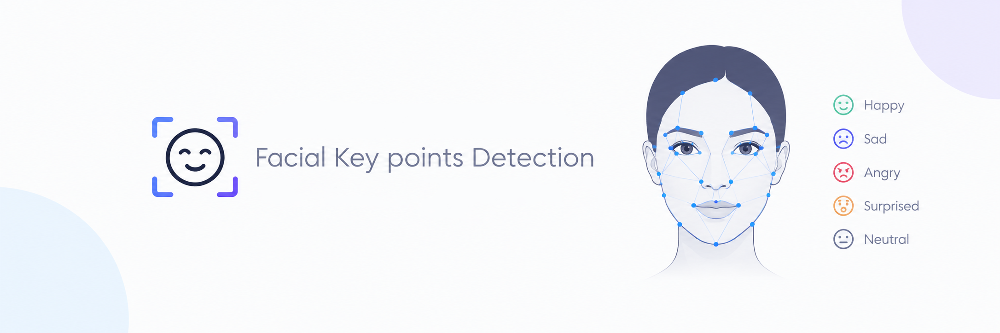

# Emotion AI: Facial Keypoint Detection Using Deep Residual Neural Networks (ResNet)

<div align="center"> 
   
</div>

[](https://www.python.org/)
[](https://tensorflow.org/)
[](https://github.com/astral-sh/uv)
[](https://jupyter.org/)
[](LICENSE)

An end-to-end Computer Vision and Deep Learning project that detects **15 facial keypoints (30 coordinates)** from 96×96 grayscale face images using a custom **Deep Residual Neural Network (ResNet)** architecture in TensorFlow / Keras.

Facial landmark detection serves as the fundamental foundation for modern **Emotion AI**, facial expression analysis, driver drowsiness detection, augmented reality face filters, biometric verification, and gaze tracking.

---

## 📑 Table of Contents

1. [Project Overview](#-project-overview)
2. [Dataset Overview](#-dataset-overview)
3. [Exploratory Data Analysis](#-exploratory-data-analysis)
4. [Image Visualization & Landmark Mapping](#-image-visualization--landmark-mapping)
5. [Data Augmentation Pipeline](#-data-augmentation-pipeline)
6. [Training & Testing Dataset Preparation](#-training--testing-dataset-preparation)
7. [Deep Residual Network Architecture (ResNet)](#-deep-residual-network-architecture-resnet)
8. [Model Training & Performance](#-model-training--performance)
9. [Evaluation & Qualitative Analysis](#-evaluation--qualitative-analysis)
10. [Error & Landmark Accuracy Analysis](#-error--landmark-accuracy-analysis)
11. [Mini Challenges & Solutions](#-mini-challenges--solutions)
12. [Installation & Getting Started](#-installation--getting-started)

---

## 🎯 Project Overview

* **Input**: Grayscale face images of resolution **96 × 96 pixels** (1 channel).
* **Output**: **30 continuous numerical values** corresponding to the `(x, y)` coordinate pairs of 15 facial landmark locations:
  * Left and right eye centers, inner/outer eye corners, and eyebrows
  * Nose tip
  * Mouth corners and top/bottom lip centers
* **Core Model**: Deep Residual Neural Network (ResNet) featuring residual shortcut connections to eliminate the vanishing gradient problem in deep networks.
* **Loss Function**: Mean Squared Error (MSE).

---

## 📊 Dataset Overview

The dataset consists of **2,140 face images** with 30 landmark coordinates:

| Property | Value |
|---|---|
| Total Samples | 2,140 images |
| Image Dimensions | 96 × 96 pixels (Grayscale) |
| Feature Columns | 30 numerical keypoints (`left_eye_center_x`, `...`, `mouth_center_bottom_lip_y`) |
| Image Column | Space-separated pixel intensity strings (0–255) |
| Target Task | Continuous Multi-Output Regression |

---

## 🔍 Exploratory Data Analysis

### Missing Value Analysis
Some facial landmarks (such as lip points or eyebrow corners) are not visible across all images due to facial occlusions, head poses, or lighting conditions.

<div align="center">
  
</div>

<br>

*Missing values are imputed using column-wise mean imputation (`facialpoints_df.mean(numeric_only=True)`).*

---

### Spatial Distribution of Facial Landmarks
Analyzing the coordinate distributions confirms anatomical symmetry between left and right facial features (e.g. eye centers positioned predictably around $x \approx 35$ and $x \approx 65$).

<div align="center">
  
</div>

---

## 🖼️ Image Visualization & Landmark Mapping

Each face image is reconstructed from 9,216 pixel values ($96 \times 96$) and overlaid with the 15 detected facial landmarks:

### Single Sample Landmark Overlay

<div align="center">
  
  
</div>

---

### Batch Sample Grid (16 Faces)
A sample grid illustrating various facial expressions, lighting variations, and facial shapes present in the dataset:

<div align="center">
  
</div>

---

## 🔄 Data Augmentation Pipeline

To prevent overfitting and double the effective dataset size, several image transformation strategies were implemented:

### 1. Horizontal Flipping
Flipping images horizontally ($y$-axis reflection) requires mirroring all $x$-coordinates ($x_{new} = 96 - x_{orig}$):

<div align="center">
  
</div>

---

### 2. Brightness Augmentation
Random brightness scaling introduces robustness against real-world lighting shifts without altering facial landmark coordinates:

<div align="center">
  
</div>

---

### 3. Vertical Flipping (Mini Challenge #3)
Vertical flipping along the horizontal axis requires adjusting $y$-coordinates ($y_{new} = 96 - y_{orig}$) while keeping $x$-coordinates fixed:

<div align="center">
  
</div>

---

## ✂️ Training & Testing Dataset Preparation

The combined original and augmented datasets are normalized to $[0, 1]$ and split into **90% Training** and **10% Testing** sets:

<div align="center">
  
</div>

<br>

### Augmented Dataset Overview (64 Random Samples)

<div align="center">
  
</div>

---

## 🧠 Deep Residual Network Architecture (ResNet)

The architecture is built upon the **ResNet** paradigm, combining:
1. **Initial Convolution**: 64 filters $(7 \times 7)$, stride 2 with Batch Normalization, ReLU, and MaxPooling.
2. **Convolutional Blocks**: Main path + projection shortcut path with $1 \times 1$ conv to align dimensions.
3. **Identity Blocks**: Residual skip connections where input is added directly to output $F(X) + X$.
4. **Dense Regressor Head**:
   * Average Pooling $(2 \times 2)$
   * Flatten
   * Dense (4096 units, ReLU) + Dropout (0.2)
   * Dense (2048 units, ReLU) + Dropout (0.1)
   * Output Dense (30 units, Linear)

---

## 📈 Model Training & Performance

The model was compiled with the Adam optimizer (`learning_rate=0.001`) and trained for **100 epochs** using `ModelCheckpoint` saved in the modern `.keras` format.

<div align="center">
  
</div>

<br>

*The loss decreases smoothly, indicating solid convergence with low generalization error.*

---

## 🧪 Evaluation & Qualitative Analysis

### Model Predictions on Unseen Test Faces
Predictions on 16 test images demonstrate accurate localization of eye centers, nose tips, and mouth corners:

<div align="center">
  
</div>

---

### Ground Truth vs. Model Predictions
A direct overlay comparing **Actual Landmarks (Red)** against **Predicted Landmarks (Green)** on test samples:

<div align="center">
  
</div>

---

## 📉 Error & Landmark Accuracy Analysis

Evaluating the Root Mean Squared Error (RMSE) across test samples confirms consistent precision with minimal outlier deviation:

<div align="center">
  
</div>

---

## 🏆 Mini Challenges & Solutions

| Challenge | Topic | Output Visualization |
|---|---|---|
| **#1** | Summary statistics for `right_eye_center_x` | Computed mean ($34.50$), min, and max |
| **#2** | 64 random faces in an 8×8 grid | [View Plot](assets/Plots/06_faces_grid_64_challenge2.png) |
| **#3** | Vertical flip augmentation with $y$-inversion | [View Plot](assets/Plots/11_vertical_flip_comparison.png) |
| **#4** | Test size sensitivity & augmented visualization | [View Plot](assets/Plots/13_augmented_data_grid_64.png) |
| **#5** | Architecture ablation (MaxPooling & Stage 4) | Full model summary with Stage 4 added |

<div align="center">
  
</div>

---

## 🚀 Installation & Getting Started

This project is optimized for [**uv**](https://github.com/astral-sh/uv), an extremely fast Python package manager and resolver.

### 1. Clone the Repository
```bash
git clone https://github.com/<your-username>/Emotion-AI-Facial-Key-points-Detection.git
cd "Emotion AI Facial Key points Detection"
```

### 2. Set Up Virtual Environment with `uv`
```bash
# Create a virtual environment using uv
uv init
uv venv

# Activate the virtual environment
# On Windows (PowerShell):
.\.venv\Scripts\activate

# On Windows (Command Prompt):
.\.venv\Scripts\activate.bat

# On macOS / Linux:
source .venv/bin/activate
```

### 3. Install Dependencies with `uv`
```bash
# Ultra-fast dependency installation
uv pip install -r requirements.txt
```

### 4. Launch Jupyter Notebook
```bash
# Run Jupyter directly via uv:
uv run jupyter notebook KeyFacialPointsDetection.ipynb

# Or with the environment activated:
jupyter notebook KeyFacialPointsDetection.ipynb
```

> **Running on Google Colab**:
> Simply upload `KeyFacialPointsDetection.ipynb` and `KeyFacialPoints.csv` to Google Colab. The notebook dynamically checks and supports Colab file paths (`/content/KeyFacialPoints.csv` and `/content/weights.keras`) automatically.


---

## 🔗 Connect with Me

<div align="center">

[](https://twitter.com/F4izy)
[](https://www.linkedin.com/in/mohd-faizy/)
[](https://ai.stackexchange.com/users/36737/faizy)
[](https://github.com/mohd-faizy)

</div>